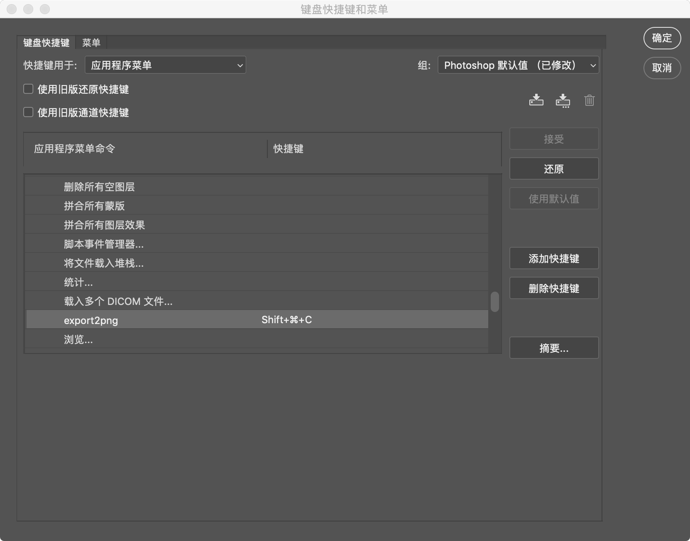

# export2png
这是一个photoshop脚本，意图帮助前端快捷处理切图工作流，他能快速将所选图层以png格式保存到指定路径下，同时拷贝图层scc样式到剪切板，如果图层为文字图层时同时拷贝文字基本css样式与图层的文本内容

#### 使用步骤

1. 下载export2png.jsx
2. 复制export2png.jsx到Photoshop的脚本文du件夹。

> OS X: /Applications/[Photoshop]/Presets/Scripts/
>
> Windows: C:\[Program Files]\Adobe\[Photoshop]\Presets\Scripts
>

3. 重启Photoshop，点击【文件】菜单 – 【脚本】 -export2png，如果有显示，表示安装成功了，

4. 设置脚本快捷键，点击【编辑】菜单 – 【键盘快捷键和菜单】- 然后将export2png设置快捷键。

   

